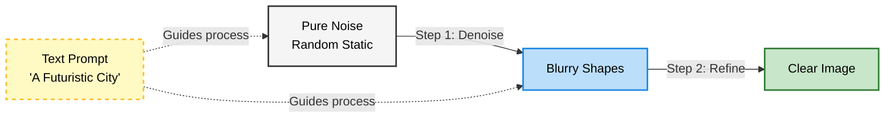
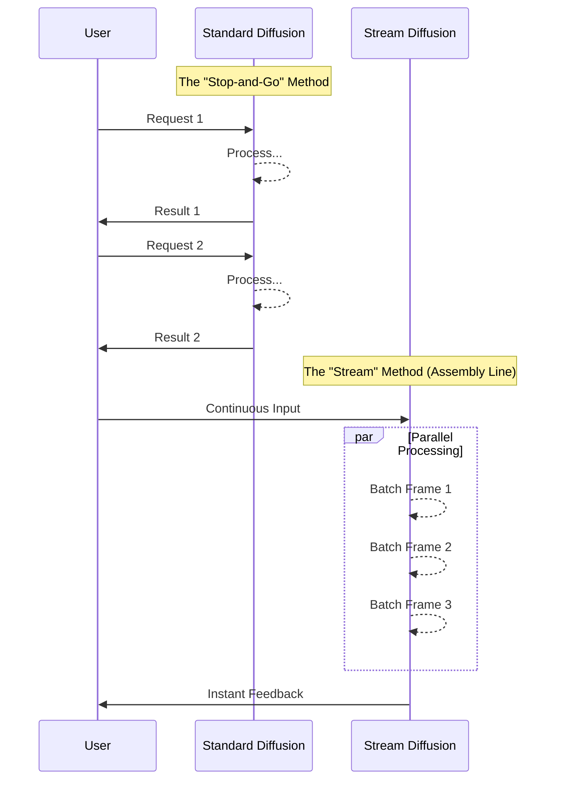

# $\color{orange}{\textsf{Scuotere il cielo}}$

Archeoparco, Cersosimo, Italy  
2024

 

## What is a Denoising Diffusion Model?

At its heart, a diffusion model is an engine designed to create order from chaos. Think of it as an artist who starts with a canvas filled with random static—like the "snow" on an old television screen—and slowly refines it until a clear, detailed image emerges.

Technically, this works through two phases:

The Forward Process (Training): The model takes clear images and slowly destroys them by adding random "noise" (static) step-by-step until the image is unrecognizable.

The Reverse Process (Generation): The model learns to reverse time. It looks at pure noise and predicts, "What would this look like if I removed a tiny bit of static?" It repeats this prediction dozens of times, gradually revealing a pristine image.

  

## How Text Guides the Process

While the model starts with random noise, it needs a map to know what to create. This is called Multimodal Modeling.

When you provide a text prompt (e.g., "A futuristic city"), the text acts as a compass. It conditions the noise removal process, steering the mathematical predictions away from a generic image and toward the specific concepts described in your words.

## Moving to Real-Time: Stream Diffusion

Standard diffusion models are like traditional painters: they must finish one painting completely before starting the next. This creates a delay, making them slow to react to changes.

Stream Diffusion changes this workflow to function more like an assembly line. Instead of calculating a single image from start to finish in isolation, it processes a continuous stream of data.

- Sequential vs. Continuous: While standard models stop to think between outputs, Stream Diffusion uses a "pipeline" approach. It accepts new input (like a webcam feed or changing text) and refines the current image instantly.

- The Result: This allows for high-speed, real-time feedback. As you interact with the model, the visual output morphs fluidly, creating a "live" experience rather than a series of static snapshots.

## The Interface: A Physical Window into AI

  

To make the abstract concept of "Latent Space" accessible, we developed a tangible interface. The device is a handheld cylinder featuring a circular display on top and an internal gyroscopic sensor.

Think of it as a "digital looking glass." By physically tilting the device, the user controls the generative process. The internal sensors detect pitch and roll (movement along two axes), translating physical motion into data that drives the Stream Diffusion model in real time.

## Interaction: Navigating the Stream
This interface turns image generation into a fluid experience rather than a static one.

Neutral Position (Stillness): When the device is held flat (pitch and roll near zero), the stream pauses or stabilizes. The image settles into a clear, recognizable state—often the most "standard" or "representative" interpretation of the prompt.

Tilting (Movement): As the user tilts the device, they "pour" new data into the system. A gentle tilt creates slow, subtle evolutions, allowing the user to examine the details of the transformation. A steep, aggressive tilt accelerates the process, pushing the model rapidly away from the standard patterns and into more experimental, divergent visual territories.

## The Experience: Intuitive Exploration
This system replaces complex software sliders with muscle memory. The combination of tactile feedback (the tilt) and instant visual response (via Stream Diffusion) creates a tight feedback loop.

Users don't just "see" the AI generating images; they "feel" like they are steering it. This allows for a physical exploration of the generative space, giving users the agency to speed up, slow down, or freeze a specific moment in the stream of creativity.

##

 

[**← back to radura**](../)
